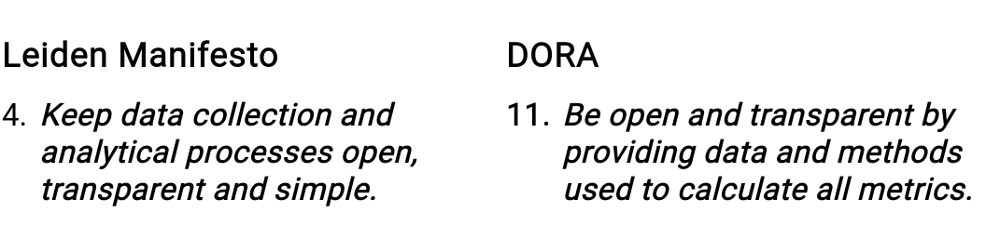

# Metrics in Context

> What is the value of a measurement if we don't know anything about the tool used to take the measurement?

Metrics in Context is an exploration of scholarly metrics and their becoming. How do the h-index, citation counts on Google Scholar, or number of shares and tweets come about as the entities that we use to assess articles, researchers, institutions, and even countries?

## Introduction

Citations are an essential part of the academic ecosystem. To be more specific, research evaluation, hiring and tenure decisions, university rankings, research discovery, and other research infrastructure build on citation data from various indexing services. While the number of these services used to be quite contained and overseeable (Web of Science and later Scopus and Google Scholar) this space is slowly turning into a hodgepodge of all kinds of new services and iniatives.

With this quickly growing and expanding landscape of data providers, the question arises if the provided datasets and citation counts are commensurable. Iniatives for the responsible use and creation of metrics such as the [San Francisco Declaration on Research Assessment](https://sfdora.org/) (DORA) or the [Leiden Manifesto](http://www.leidenmanifesto.org/) both emphasise the importance of transparancy and openness when it comes to the processes and practices of data creation.

In this project, I propose to develop a process-centric systematic approach to describe and compare these data collection and analytic processes that lead to each metrics.

## Outline

This project entails three major components which I am tackling quite independently as the first one addresses conceptual questions around the processes and procedures that lead to what we consider metrics. The second part concerns the implementation of that framework in Frictionless in the form of a dedicated [data package](https://specs.frictionlessdata.io/data-package/). Finally, we will give it a test run with some real data coming from work conducted at the [ScholCommLab](https://scholcommlab.ca).

- *Phase 1*: Creation of an analytic framework to talk about the provenance of scholarly metrics 
- *Phase 2*: Prototype of a Frictionless Data Package in order to describe, verify, and transform metrics datasets
- *Phase 3*: Testing with real data

You can find a (messy) roadmap [here](https://github.com/Bubblbu/metrics-in-context/issues/2) where I am trying to keep a timeline, milestones, and goals in sight using Github Issues. I will try to document insights and progress in this pinned issue and keep corresponding issues for sub-tasks updated.

## Prototype 1 | Frictionless Provenance

You can find the first prototype explained and discussed in this notebook:

https://github.com/Bubblbu/metrics-in-context/blob/master/prototypes/1_scite/prototype_1_scite.ipynb

### FOSDEM 2021 Lightning Talk

You can find the slides for the presentation here: [materials/FOSDEM 2021/presentation_slides.pdf]([materials/FOSDEM 2021/presentation_slides.pdf](https://github.com/Bubblbu/metrics-in-context/blob/master/materials/FOSDEM%202021/presentation_slides.pdf))

## Other Resources

### Frictionless Blog Posts

**Introductory blog post (17.09.2020)**

[https://frictionlessdata.io/blog/2020/09/17/tool-fund-metrics/](https://frictionlessdata.io/blog/2020/09/17/tool-fund-metrics/)

### Previous ScholCommLab Projects

In [this paper](https://www.mitpressjournals.org/doi/full/10.1162/qss_a_00044) we proposed an alternative method to collect the number of times a scholarly article was shared on Facebook. While this paper focusses on the technical challenges and implications of this new method, the underlying concerns have already been the same ones that are addressed by this project.

## Acknowledgements

This project has been funded by the Frictionless Data Tool Fund.

I also want to specifically thank Lilly Winfreed for being patient with me during a global pandemic and providing guidance and input on my usually messy thoughts and ideas.