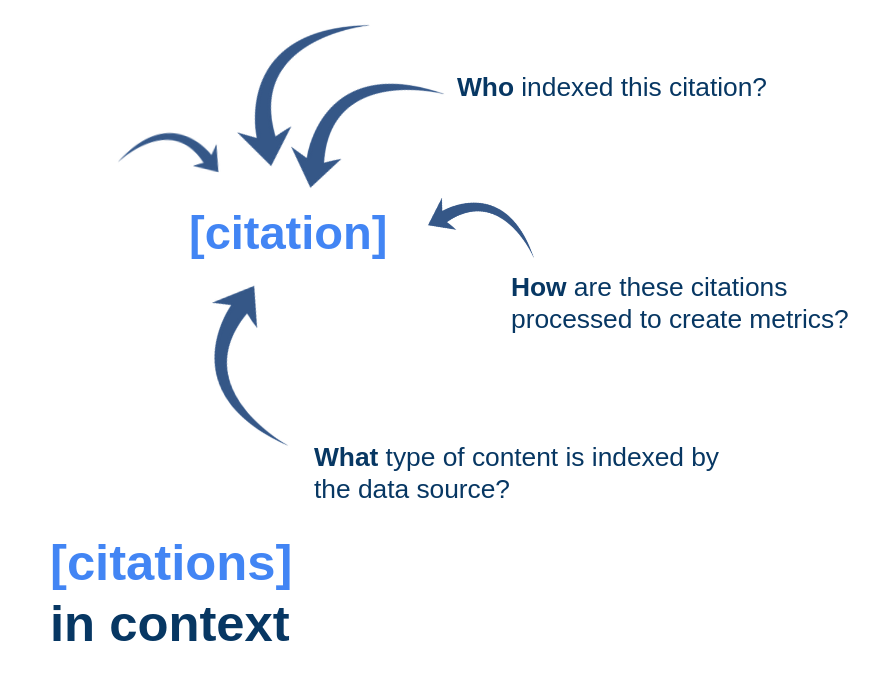
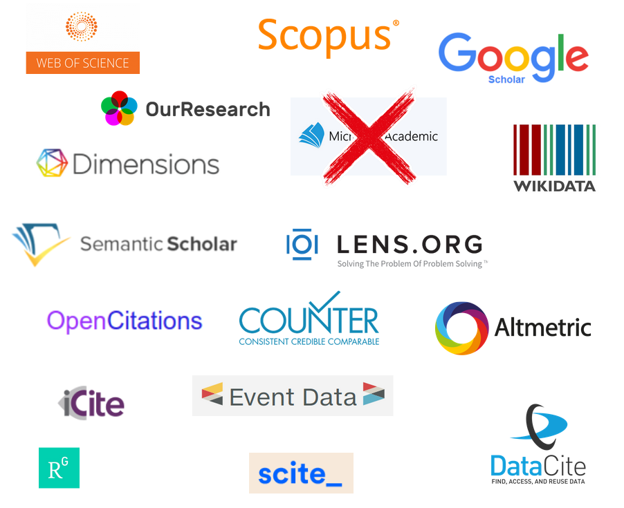

# Metrics in Context

Metrics in Context is a Frictionless Tool Fund project that explores the question of packaging and delivering scholarly metrics with their provenance information within one data structure.

*Scholarly metrics* are citation counts, indicators derived from citations, access and download counts, or social media shares for scholarly articles. *Provenance* refers to metadata for a record that details its origin and how it came about in its final form. 

In other words, this project is about citation counts in a way that describes how a citation in an article was extracted, turned into data, and aggregated into a citation count. 

## Introduction

### What are citations in context?

What is so special about the context of citations? To be clear, I am not talking about the textual context of citations which might be interested in questions like "was the article cited in the methods section?" or "was it mentioned in a positive or negative manner?".

In this project, I am hoping to explore context of the citation as an entry in a database. How did the citation get from an article into that database? What types of content are tracked in that database? How are those data records then processed into the citation counts and metrics that we use?

### Why citations in context?

The two main reasons why we should be considering citations in context with their provenance are have both been studied and explored by academic communities in detail.

**1. The uses of citation data**

Citations as data fuel many parts of the moderny scholarly infrastructure. We are not only talking about search engines that use citations to provide insights into citation networks, sophisticated discovery tools that go beyond the basic citation graph, but also researcher and institutional profiles. Quite importantly, large parts of research assessment including hiring and promotion guidelines.

Citations as data impact and shape the very lives of researchers in an increasingly complex and opaque ways.

**2. The sources of citation data**

At the same time, the number of organizations and projects that provide their own citation data sets is increasing due to technological and legal changes in the scholarly publishing landscape. The following image is just a brief overview of various scholarly metrics that have come and gone in the last years.

While efforts to make these processes of creation more transparent have led to important community-owned infrastructures and more open citation data, not too much progress has been made in the ways we attempt to describe these open and closed sources of citation data.

### A Frictionless Citation Data Package

This is where Metrics in Context comes into play. I propose to explore how we can combine citation data and their provenance information in productive ways to start untangling the quandary that exists between the ways we *use* and *create* citation data.

A Frictionless Citation Data Package entails:

1. *The citation data*. Typically citation counts for articles, authors, or institutions. Other examples are in-text citation statements, or metrics like h-index or journal impact factor.
2. *A metadata schema*. The metadata schema describes the present dataset and provides information for each field/column in it. Information should contain a basic description of the type of metric and who created the original data.
3. *Citation index profiles*. Citation index profiles are JSON files that provide standardized descriptions of citation indexes (and other creators of scholarly metrics). 

## Development

You can find a (messy) roadmap [here](https://github.com/Bubblbu/metrics-in-context/issues/2) where I am trying to keep a timeline, milestones, and goals in sight using Github Issues. I will try to document insights and progress in this pinned issue and keep corresponding issues for sub-tasks updated.

### Proof of Concept

A proof of concept is presented in this [notebook](https://github.com/Bubblbu/metrics-in-context/blob/master/prototypes/1_scite/prototype_1_scite.ipynb)

### Prototype | Citation Data Package

In development.

## Other Resources

### Frictionless Blog Posts

**Introductory blog post (17.09.2020)**

[https://frictionlessdata.io/blog/2020/09/17/tool-fund-metrics/](https://frictionlessdata.io/blog/2020/09/17/tool-fund-metrics/)

### FOSDEM 2021 Lightning Talk

You can find the slides for the presentation here: [materials/FOSDEM 2021/presentation_slides.pdf](https://github.com/Bubblbu/metrics-in-context/blob/master/materials/FOSDEM%202021/presentation_slides.pdf)

### Frictionless Hackathon

### Related research

In [this paper](https://www.mitpressjournals.org/doi/full/10.1162/qss_a_00044) we proposed an alternative method to collect the number of times a scholarly article was shared on Facebook. While this paper focusses on the technical challenges and implications of this new method, the underlying concerns have already been the same ones that are addressed by this project.

## Acknowledgements

This project has been funded by the Frictionless Data Tool Fund.

I also want to thank Lilly Winfreed for being patient with me during a global pandemic and providing guidance and input on my usually messy thoughts and ideas.