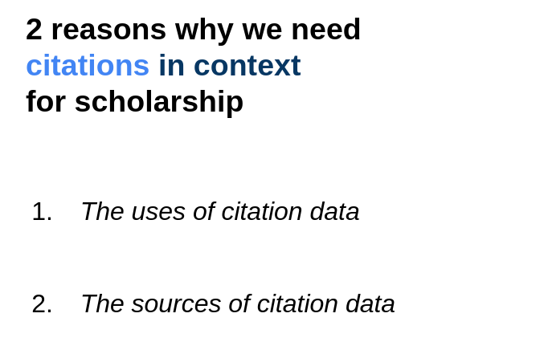

# Metrics in Context

Delivering scholarly metrics packaged with provenence information. 

## Why Metrics in Context?

Citations are an essential part of the academic ecosystem. To be more specific, research evaluation, hiring and tenure decisions, university rankings, research discovery, and other research infrastructure build on citation data from various indexing services. While the number of these services used to be quite contained and overseeable (Web of Science and later Scopus and Google Scholar) this space is slowly turning into a hodgepodge of all kinds of new services and iniatives.

You can find a (messy) roadmap [here](https://github.com/Bubblbu/metrics-in-context/issues/2) where I am trying to keep a timeline, milestones, and goals in sight using Github Issues. I will try to document insights and progress in this pinned issue and keep corresponding issues for sub-tasks updated.

## Proof of Concept

A proof of concept is presented in this [notebook](https://github.com/Bubblbu/metrics-in-context/blob/master/prototypes/1_scite/prototype_1_scite.ipynb)

## Prototype | Citation Data Package

tbd

## Other Resources

### Frictionless Blog Posts

**Introductory blog post (17.09.2020)**

[https://frictionlessdata.io/blog/2020/09/17/tool-fund-metrics/](https://frictionlessdata.io/blog/2020/09/17/tool-fund-metrics/)

### FOSDEM 2021 Lightning Talk

You can find the slides for the presentation here: [materials/FOSDEM 2021/presentation_slides.pdf](https://github.com/Bubblbu/metrics-in-context/blob/master/materials/FOSDEM%202021/presentation_slides.pdf)

### Frictionless Hackathon

### Related research

In [this paper](https://www.mitpressjournals.org/doi/full/10.1162/qss_a_00044) we proposed an alternative method to collect the number of times a scholarly article was shared on Facebook. While this paper focusses on the technical challenges and implications of this new method, the underlying concerns have already been the same ones that are addressed by this project.

## Acknowledgements

This project has been funded by the Frictionless Data Tool Fund.

I also want to specifically thank Lilly Winfreed for being patient with me during a global pandemic and providing guidance and input on my usually messy thoughts and ideas.